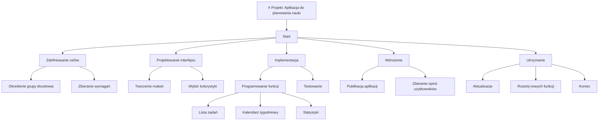

```mermaid
graph TD
    A[# Projekt: Aplikacja do planowania nauki]
    
    B[Start]
    B --> C[Zdefiniowanie celów]
    C --> C1[Określenie grupy docelowej]
    C --> C2[Zbieranie wymagań]
    
    B --> D[Projektowanie interfejsu]
    D --> D1[Tworzenie makiet]
    D --> D2[Wybór kolorystyki]
    
    B --> E[Implementacja]
    E --> F[Programowanie funkcji]
    F --> F1[Lista zadań]
    F --> F2[Kalendarz tygodniowy]
    F --> F3[Statystyki]
    E --> G[Testowanie]
    
    B --> H[Wdrożenie]
    H --> H1[Publikacja aplikacji]
    H --> H2[Zbieranie opinii użytkowników]
    
    B --> I[Utrzymanie]
    I --> I1[Aktualizacje]
    I --> I2[Rozwój nowych funkcji]
    
    A --> B
    I --> J[Koniec]
```
