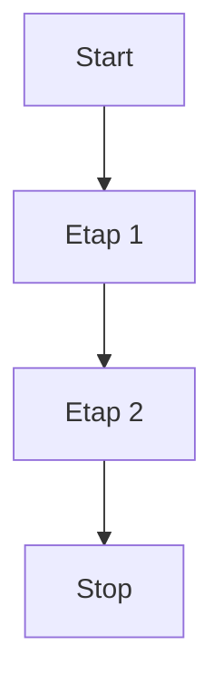
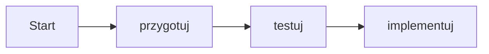

Opis nagłówków:
# Nagłówek 1
## Nagłówek 2
### Magłówek 3

Pogróbienie i kursywa
**pogruinie**  
*kursywa*

Lista:
- pierwszy element listy
- drugi element listy
  - podpunkt
    - podpunkt 2

Kod:
<pre>Kod programu</pre>

```
kod 2
```

Linki:  
[Tekst linku](https://wp.pl)

Obrazy:  


Cytaty:  
> Cytat  
> i druka linia cytatu
>   

Lista numerowana:  
1. Pierwszy wpis
2. Drugi wpis
  3. Trzeci wpis
  4. czwartey wpis

Task Lista:  

- [ ] zadanie 1
- [x] zadanie 2
- [ ] zadanie 3

Tabela:
| Lp. | Nazwa Tasku     | Sprint | Status |
|-----|-----------------|--------|--------|
| 1   | Konfiguracja AD | 1      | [ ]    |
| 2   | Test penetracji | 2      | [x]    |
| 3   | Automatyzacja   | 1      | [ ]    |
| 4   | Raport          | 2      | [x]    |




